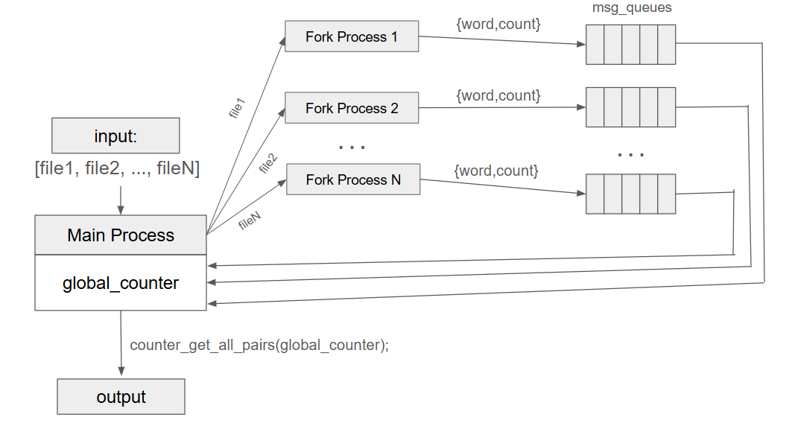
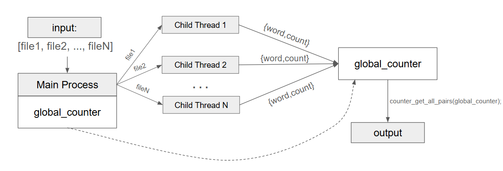

# multithreaded-wordmap

MapReduce-inspired word-count done with multi processes or multithreads.

# Word Counter

Counter struct is built upon AATree, it is used to read a given file and represent each unique occurence as a node in the AATree.

To read how the AATree is implemented, read [generic-aatree-c](https://github.com/chongdayou/generic-aatree-c).

# Multi-Processes Version

In the multi-processes version, parent process creates a fork process for each file. Each fork process opens its own message queue, and send each pair `{word,count}` as a message. Parent process waits for all the messages, putting each received pair into the `global_counter`, then calls `wait()` on all fork processes, and finally delete all the used message queues.

The program described above is in `main-multiproc.c`, and the fork processes created are in `main-sender.c`.

# Multi-Threaded Version

An advantage of multi-threads program is that heap-allocated memory is shared across all threads. In the multi-threaded version, parent thread allocates a `global_counter`, then create a thread for each file, passing in the `filename` as parameter. Each child thread then read each word from its given file and add it to the global_counter.

Note that `global_counter` can be simultaneously updated by all child threads, therefore a mutex lock wraps around point of insertion into `global_ounter` to parent race conditions.

The program described above is in `main-multithreads.c`.

# Additional Info
## References
[generic-aatree-c](https://github.com/chongdayou/generic-aatree-c): AATree implementation in C with iterable and generic type behavior